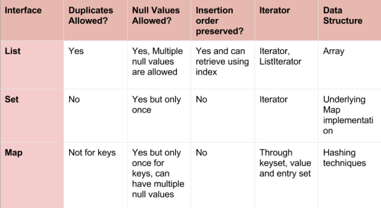
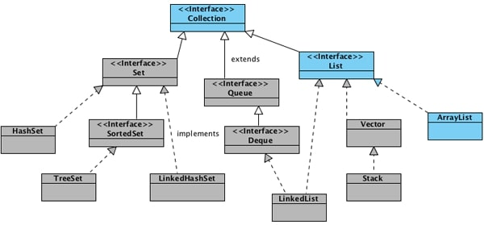
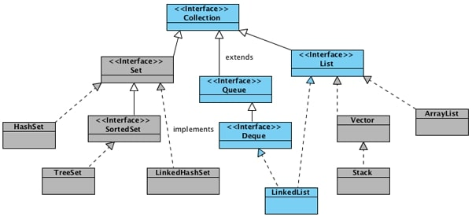
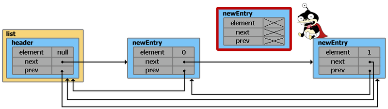
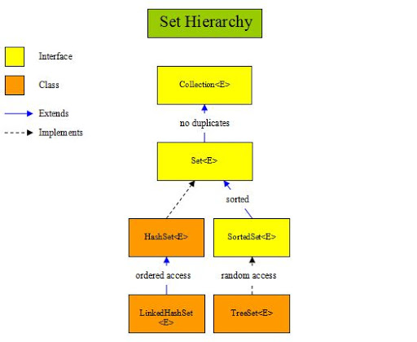
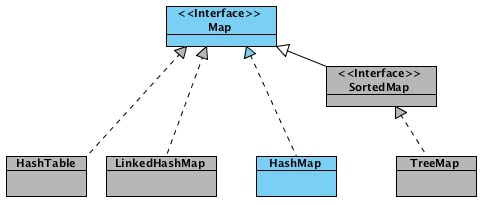
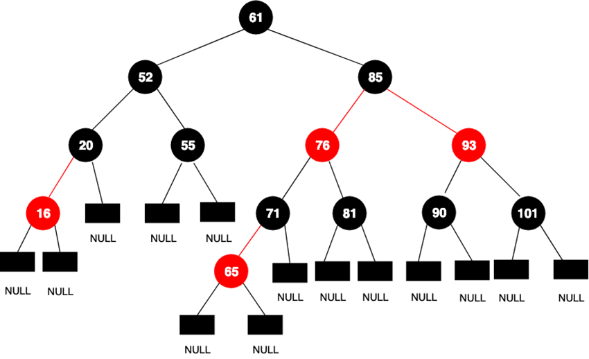
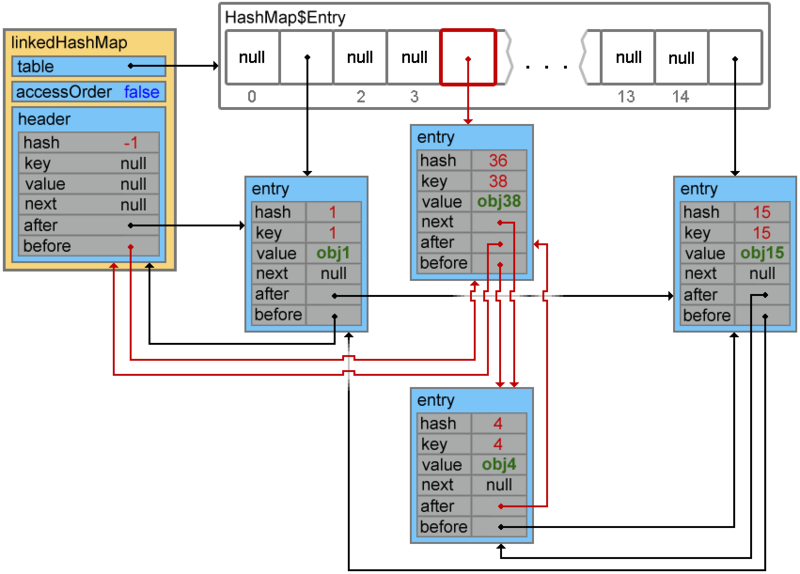

# Java Collections and Map Guide.

## Table of contents

- [Collection](#collection)
  - [Set vs List](#set-vs-list)
  - [ArrayList](#arraylist)
  - [LinkedList](#linkedlist)
  - [TreeSet(SortedSet)](#treesetsortedset)
- [Map](#map)
  - [HashMap](#hashmap)
  - [TreeMap](#treemap)
  - [Сравнение Map](#сравнение-map)

## Collection 

**Collection** - это коллекция.


### Set vs List
- У сета уникальные значения (относительно equals элементов), но нет упорядоченности.
- У листа неуникальные значения, но есть упорядоченность, из-за чего есть get.
  
- У листа есть ListIterator. ListIterator - это интерфейс, каждый рабочий лист его реализует в приватном классе.
  <br></br>
  
  
### ArrayList


**ArrayList** сначала пустой, и вообще это Object[] elementData, когда добавляем, он создает копию, но на 1 больше capacity. Через рефлексию прикольно смотреть как grow работает.
size() возвращает 0, а elementData.length() 10).
Всё изначально объекты, даже elementData, которую приходится приводить к Object[].
Для добавления/удаления делаются копии.

Неплохо расписано на [хабр](https://habr.com/ru/post/128269/).

### LinkedList


Там внутри нет никакой коллекции, есть first и last, а add просто вызывает linkLast(e).
*Скучно*.

Неплохо расписано на [хабр](https://habr.com/ru/post/127864/).

### TreeSet(SortedSet)

Про сеты [тут](http://developer.alexanderklimov.ru/android/java/set.php).



Сортирует элементы. Ну короче мапа внутри, тут TREEMAP. <br>
Add такой же. Похоже, что сортирует именно [TreeMap](#treemap). (Так оно и есть.)

```
private transient NavigableMap<E,Object> m;

// Dummy value to associate with an Object in the backing Map
private static final Object PRESENT = new Object();
```

### HashSet
```
private transient HashMap<E,Object> map;
// Dummy value to associate with an Object in the backing Map
    private static final Object PRESENT = new Object();
public boolean add(E e) {
        return map.put(e, PRESENT)==null;
    }
```
*ОХ УЖ ЭТИ DUMMY VALUE.* <br>
Может иметь НЕ уникальные значения, как и HashMap, проверка == null фильтрит true для equals:
```
Adds the specified element to this set if it is not already present.
 More formally, adds the specified element e to this set if this set
  contains no element e2 such that Objects.equals(e, e2). If this set
   already contains the element, the call leaves the set unchanged and
    returns false.
Params:
e – element to be added to this set
Returns:
true if this set did not already contain the specified element
```
## Map
**Map** - это карта.


### HashMap



**HashMap** - похожа на Hash таблицу, хешам соотвествуют Bucketы, у которых есть LinkedList с Nodами (hash). И если хэш-функции сделаны нормально, то всё работает замечательно. А так максимум O(n), минимум O(1). LinkedList потому что быстро, в отличии от того же Array (меняем ссылку на некст, а не сдвигаем элементы).  
> DEFAULT_INITIAL_CAPACITY = 1 << 4; // aka 16 © JavaDoc

Почитать на [хабр](https://habr.com/ru/post/128017/).

### TreeMap

Почитать можно [тут](https://javarush.ru/groups/posts/2584-osobennosti-treemap).

Сортировка по ключам. Хранит корень дерева. Прикол красного и черного:

Поиск нужного элемента начинается из корня дерева, в нашем случае это 61. Дальше происходит сравнение с необходимым значением. Если наше значение меньше — отправляемся в левую сторону, если больше — в правую. Так происходит до тех пор, пока не найдем необходимое значение или не упремся в элемент со значением null (листок дерева). Красные и черные цвета используются для упрощения навигации по дереву и его балансировки. 

Существуют правила, которые всегда должны быть соблюдены при постройке красно-черного дерева:

* Корень должен быть окрашен в черный цвет.
* Листья дерева должны быть черного цвета.
* Красный узел должен иметь два черных дочерних узла.
* Черный узел может иметь любые дочерние узлы.
* Путь от узла к его листьям должен содержать одинаковое количество черных узлов.
* Новые узлы добавляются на места листьев.

Если посмотреть на правила 3, 4 и 5 в совокупности, можно понять, как окраска узлов ускоряет навигацию по дереву: путь через черные узлы всегда короче, чем через красные. Поэтому по количеству именно черных узлов и определяется общий размер дерева, и называется этот размер “черная высота”.

КОРОЧЕ: МЕНЬШЕ - КРАСНОЕ, БОЛЬШЕ - ЧЁРНОЕ.

### LinkedHashMap

Почитать на [хабр](https://habr.com/ru/post/129037/).

<br>
*Смерть*

Только что созданный объект **LinkedHashMap**, помимо свойств унаследованных от HashMap (такие как table, loadFactor, threshold, size, entrySet и т.п.), так же содержит два доп. свойства:
header — «голова» двусвязного списка. При инициализации указывает сам на себя;
accessOrder — указывает каким образом будет осуществляться доступ к элементам при использовании итератора. При значении true — по порядку последнего доступа (об этом в конце статьи). При значении false доступ осуществляется в том порядке, в каком элементы были вставлены.



Данная структура может слегка уступать по производительности родительскому HashMap, при этом время выполнения операций add(), contains(), remove() остается константой — O(1). Понадобится чуть больше места в памяти для хранения элементов и их связей, но это совсем небольшая плата за дополнительные фишечки.

Вообще, из-за того что всю основную работу на себя берет родительский класс, серьезных отличий в реализации HashMap и LinkedHashMap не много. Можно упомянуть о парочке мелких:

- Методы transfer() и containsValue() устроены чуть проще из-за наличия двунаправленной связи между элементами;
- В классе LinkedHashMap.Entry реализованы методы recordRemoval() и recordAccess() (тот самый, который помещает элемент в конец при accessOrder = true). В HashMap оба этих метода пустые.


### Сравнение Map

1) The HashMap class is roughly equivalent to Hashtable, except that it is non synchronized and permits nulls. (HashMap allows null values as key and value whereas Hashtable doesn't allow nulls).
2) HashMap does not guarantee that the order of the map will remain constant over time.
3) HashMap is non synchronized whereas Hashtable is synchronized.
4) Iterator in the HashMap is fail-safe while the enumerator for the Hashtable is not and throw ConcurrentModificationException if any other Thread modifies the map structurally by adding or removing any element except Iterator's own remove() method. But this is not a guaranteed behavior and will be done by JVM on best effort.

/ | HashMap | LinkedHashMap | TreeMap
------------ | ------------- | ------------ | -------------
Порядок хранения данных | Случайный. Нет гарантий, что порядок сохранится на протяжении времени	| В порядке добавления | В порядке возрастания или исходя из заданного компаратора
Время доступа к элементам |	O(1) | O(1) | O(log(n))
Имплементированные интерфейсы | Map | Map | NavigableMap SortedMap Map
Имплементация на основе структуры данных | Корзины (buckets) | Корзины (buckets) | Красно-чёрное дерево (Red-Black Tree)
Возможность работы с null-ключом | Можно | Можно | Можно, если используется компаратор, разрешающий null
Потокобезопасна | Нет |	Нет | Нет